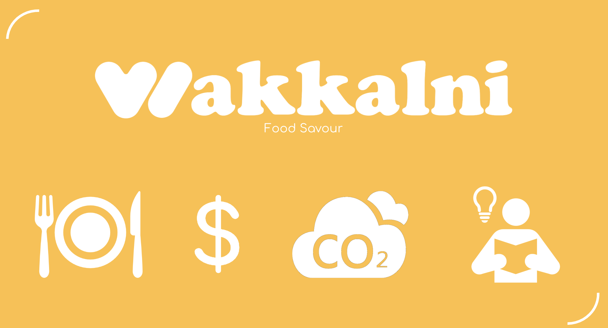

# wakkalni
NYUAD Hack for Social Good in the Arab World



Here are the steps for running the app:
```
$ cd /directory/to/wakkalni
$ npm install express-generator -g
$ npm install nodemon -g
$ express --view=ejs /directory/to/wakkalni
$ npm install
$ nodemon start
```

Now, wakkalni should be running at `http://localhost:3000`.

Full slide deck [here](./slides.pdf).
